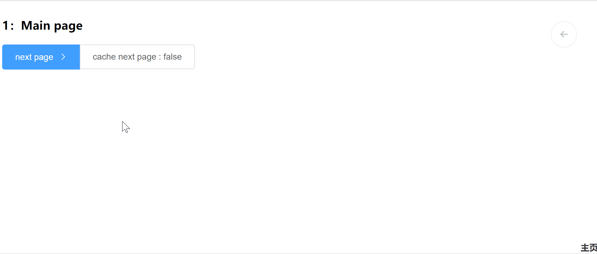

# skip-page -  skip/cache page component

[]

## Install
```bash
npm install skip-page --save
```

## NPM
```JavaScript
import Vue from 'vue'
import skipPage from 'skip-page'
```

## Browser
```JavaScript
<script src="skip-page\dist\skip-page.umd.min.js"></script>
```

Register components:
```JavaScript
Vue.use(skipPage);
or
Vue.component('skip-page', skipPage);
```


## Usage

#### main.vue
```JavaScript

<skip-page ref="skipPage" :props="config">
    ...
</skip-page>
```

#### Default config below
```JavaScript
config: {
        main: '主页', // The breadcrumb of main page
        goBackTitle: '返回',
        showGoBack: true,
        showBreadcrumb: true
    }
```

### The use of  ***skip(component，config)***
* @param ***component*** {Number | string | component} The target page of jump
* @param ***config***

```JavaScript

// From main page skip to 'other.vue'
import other from 'other.vue'
this.$refs.skipPage.skip(other)

// skip to main page
 this.$parent.skip()

// skip to previous page
 this.$parent.skip(-1)

//skip by component.name
skip('componentName')
```
#### props、emit
```JavaScript
var config = {
         cache:false,
         title: '',  // breadcrumb title
         props: {},
         emit: {}
  }

skip(component,config)

```
